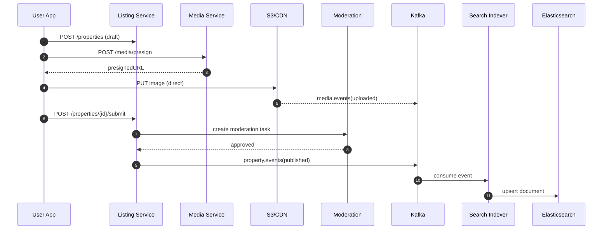

# System Design Document (SDD) — Real Estate Platform (Housing.com / 99acres-like)

**Version 1.1 (Production-Grade)**  
**Date:** 18 Dec 2025  
**Scope:** Rent + Buy | Agents/Builders onboarding + Admin moderation | Premium listing/subscription

## Executive Summary

We are building a high-scale real-estate marketplace that supports Rent + Buy, Agents/Builders onboarding, Admin moderation, and Premium listing/subscription monetization.

The platform must handle 10M+ listings and millions of daily active users with heavy image/video traffic, keeping search latency under 200ms (p95) and overall availability at 99.9%.

## 1. Goals & Non-Goals

Goals (must-have):
• Rent + Buy search with advanced filters and map view
• Listing lifecycle with moderation workflow
• Media uploads with CDN delivery
• Lead/inquiry pipeline with notifications
• Premium listing/subscription monetization
• Observability + DR/backup plan

Non-goals (phase-2):
• Full AI personalization (initially basic ranking/boosting)
• Mortgage/loan marketplace
• Deep calendar scheduling marketplace (basic appointments in v1)

## 2. Requirements

2.1 Functional Requirements
User-facing:
• Signup/login (OTP/email), profile
• Search (text + filters + map), property detail pages
• Shortlist, saved searches, price alerts
• Contact seller/agent → lead creation
• Report listing (spam/fake)

Supply-side (Agents/Builders):
• Onboarding + KYC + verification
• Create/manage listings or project inventory
• Purchase premium boosts and view performance (views/leads)

Admin/Ops:
• Moderation queue (approve/reject/changes requested)
• Fraud controls (duplicates, blacklists, rate limits)
• Content ops (SEO pages, banners, metadata)
• Packages/subscriptions, refunds/disputes

2.2 Non-Functional Requirements (SLO/SLA)
Latency (p95):
• Search < 200ms
• Property detail < 150ms
• Lead creation < 300ms
Availability: 99.9% monthly
Consistency: Listing DB is source-of-truth; Search index is eventual consistent
Security: PII encryption, audit logs, WAF + rate limiting, consent + retention policies

## 3. Architecture Overview (Microservices)

Clients: Web (React.js), Mobile (React Native/Flutter)

CDN: CloudFront/Cloudflare for static assets and media

API Gateway: routing, auth, rate limiting, request logging

Runtime: Kubernetes (K8s) on cloud (EKS/GKE/AKS)

Datastores: MongoDB (Listings), PostgreSQL (Users/Agents/Billing), Elasticsearch/OpenSearch (Search), Redis (Cache), Kafka (Events), S3/Object storage (Media)

## 4. Service Catalog

Core services:
1) User Service (auth, sessions, consent)
2) Agent/Builder Service (orgs, KYC, verification)
3) Listing/Property Service (CRUD, lifecycle, validation, ownership, versioning)
4) Moderation Service (rules + manual review)
5) Search Service (ES queries, ranking, suggestions, reindex)
6) Media Service (presigned upload, processing, derivatives)
7) Lead/Inquiry Service (contact seller, pipeline, assignment)
8) Billing/Premium Service (packages, subscriptions, payments, refunds)
9) Notifications Service (SMS/email/WhatsApp/push)
10) Geo Service (localities, boundaries, clusters)
11) Analytics/Event Service (event ingestion, funnels)

## 5. Data Ownership & Consistency

Source of Truth:
• Listings/Properties: MongoDB (Listing Service)
• Users/Agents/Builders/Billing: PostgreSQL
• Search: Elasticsearch derived index

Consistency model:
• Writes go to source DBs
• Listing publish/update emits Kafka events
• Search index updates asynchronously (seconds-level)
• UX: Newly posted listings may show 'Processing' briefly; fallback fetch from Listing DB if needed

## 6. Domain Model

Listing types:
• RENT
• RESALE
• PROJECT (builder)
• PROJECT_UNIT (inventory unit)

Lifecycle state machine:
DRAFT → SUBMITTED → UNDER_REVIEW → PUBLISHED → EXPIRED → ARCHIVED
                 ↘ REJECTED ↗ (resubmit)

Duplicate & Quality:
• Dedupe by normalized address + geo hash + phone + media fingerprints (phased)
• Quality scoring based on missing fields, image count, abnormal price/area

## 7. Databases (High-level Schemas)

7.1 MongoDB — properties (source-of-truth)
Key fields: type, status, owner, pricing, attributes, location (geo), media, moderation, premium, audit.
Indexes: status+city+locality, 2dsphere on location.geo, owner keys, premium tier+activeUntil, updatedAt.

7.2 MongoDB — property_versions
Immutable history with diff, version, actor, timestamp.

7.3 PostgreSQL — users & sessions
Users table with role; session table with refresh token rotation.

7.4 PostgreSQL — organizations & KYC
Organizations (agent firm/builder), KYC documents with review status.

7.5 PostgreSQL — packages/subscriptions/payments
Packages define tiers; subscriptions track validity; payments store gateway status + webhooks.

## 8. Search Architecture

Indexing pipeline: Listing → Kafka → Search Indexer → Elasticsearch upsert

Reindex (zero downtime): blue/green indices + alias swap

Search features: full-text analyzers + synonyms, geo queries (bbox/radius), filters, autocomplete, ranking with premium boost + freshness + quality score

## 9. Media Pipeline

Upload: client requests presigned URL → uploads directly to S3 → worker generates derivatives (thumb/webp), strips EXIF, optional scanning → served via CDN

Security: enforce content-type/size, EXIF removal, optional signed CDN URLs, hotlink protection

## 10. Eventing (Kafka)

Topics:
• property.events.v1
• media.events.v1
• lead.events.v1
• billing.events.v1

Standard event envelope includes eventId, eventType, occurredAt, producer, version, payload.

Idempotency: consumers upsert by (propertyId, version) and store processed eventIds; retry with DLQ for poison messages.

## 11. API Design Standards

Versioning: /v1

Pagination: cursor-based for large lists

Idempotency-Key header for POST

Rate limiting: per IP + per user token (Redis)

Standard error contract: error.code, error.message, traceId

Representative endpoint groups: Auth/User, Orgs/KYC, Properties lifecycle, Search, Leads, Billing, Media, Admin moderation.

## 12. Key Flows

Write Path (Post & Publish): create draft → upload media → submit → moderation (auto/manual) → publish → event → index → cache invalidate

Read Path (Search): query ES → return ids/snippets → fetch details (batched) → cache hot data → images via CDN

## 13. Caching Strategy (Redis)

Cache: property detail (TTL 5–15m), filter metadata (24h), SEO pages (1–6h), rate-limit counters (1–10m)

Invalidation: on property publish/update/expire events invalidate keys like prop:{id}

## 14. Scaling Strategy

Stateless services autoscale via HPA (CPU/QPS)

MongoDB sharding by city/geoHashPrefix; ES multi-node cluster; Postgres read replicas

Async processing for indexing/media/notifications via Kafka consumers

## 15. Reliability, DR & Backups

Targets: RPO 15 minutes, RTO 60 minutes

Multi-AZ deployment, automated backups, monthly restore drills

Timeouts + retries + circuit breakers; DLQ for Kafka

## 16. Security & Compliance

JWT access tokens + refresh rotation; RBAC (USER/AGENT/BUILDER/ADMIN)

PII encryption at rest (KMS) and TLS in transit

Audit logs for admin and critical changes (immutable)

WAF + bot protection + rate limits; consent + data deletion/export workflows

## 17. Observability

Distributed tracing with a traceId from gateway to all services

Metrics: p95 latency, error rate, cache hit ratio, ES query time/index lag, Kafka consumer lag

Alerts: SLO burn rate, error spikes, indexing lag

Dashboards: business KPIs (leads/day, published/day, conversion funnel)

## 18. Testing & Release

Unit + integration tests; contract tests for events; load testing for search/leads/media

Deployment: canary/blue-green with feature flags; backward compatible schema changes

## 19. Milestones

Phase 1 (8–12 weeks): Auth, Listings lifecycle + moderation, Search, Media, Leads, basic Premium

Phase 2: Dedupe + quality scoring, stronger fraud tooling, builder inventory import pipelines, ranking improvements

## Appendix — Sequence Diagram (Mermaid)

